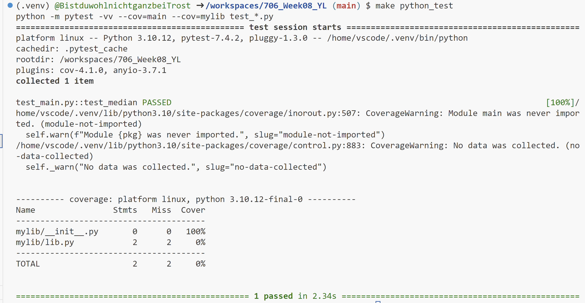

# 706_Week08_YL

This repository includes the main tasks for Week 8:

* `Makefile` is a configuration file used in Unix-based systems for automating tasks and building software. It contains instructions and dependencies for compiling code, running tests, and other development tasks.
* `.devcontainer` includes a Dockerfile and `devcontainer.json`. The `Dockerfile` within this folder specifies how the container should be built, and other settings in this directory may control development environment configurations.
* `Workflows` includes GitHub Actions, which contain configuration files for setting up automated build, test, and deployment pipelines for your project.
* `.gitignore` is used to specify which files or directories should be excluded from version control when using Git.
* `README.md` is the instruction file for the readers.
* `main.py` is a Python file that contains the main function.
* `main.rs` is a file that rewrites `main.py` in Rust.
* `test_main.py`  is a test file for `main.py` that can successfully run in IDEs.
* `requirements.txt` is to specify the dependencies (libraries and packages) required to run the project.
* `Cargo.toml`
* `lib.rs`
* `lib.py`
* `test_main.rs`

## Project description

* Rewrite an existing Python script for data processing in Rust
* Highlight improvements in speed and resource page
* Build using `cargo build` and run using `cargo run`

## Project environment

* Use codespace for scripting
* Container built in `devcontainers` and virtual environment activated via `requirements.txt`

## Script comparison

* I write my code in Python to read the csv file and get the median values of the numeric columns.

* Create `Cargo.toml` and transform the Python script to Rust, and create `lib.rs` and `main.rs`.

* Create `test_main.rs` to test the functions written in Rust.

* Add a content for both Rust and Python in `Makefile`.

### Rust script
The workflow and logic is very similar to Python. Rust reads data from the csv file in `main.rs` using exernal crate `csv`, and uses the function `calculate_median` to calculate the medians of numeric columns in the dataset. I sorted the data in the columns using `sort_by` method. To deal with potential missing values, I used `a.partial_cmp(b).unwrap()`. To calculate the running time, memory usage and CPU usage for the code, I used `Instant`, `sys_info::mem_info`, and `std:process:Command` respectively.

### Python script
To calculate CPU usage and memory usage, I used `psutil.cpu_percent()` and `psutil.virtual_memory()` respectively.

For Python script,

## Check format & errors

1. make format

2. make lint

3. make test
